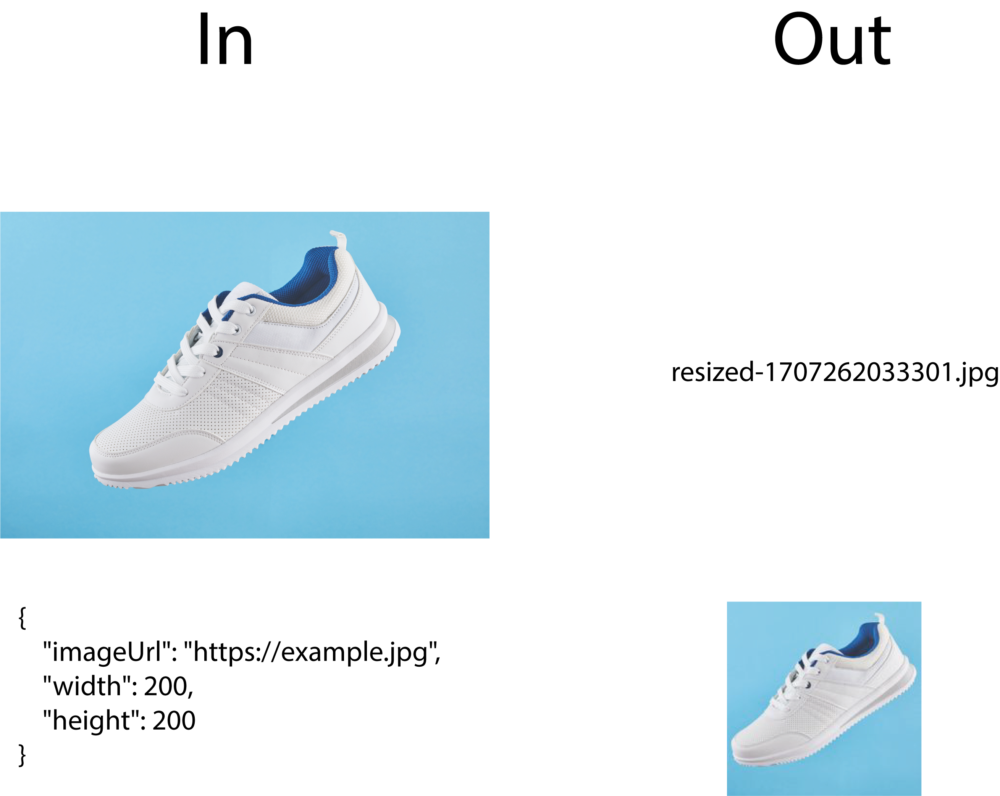

# Nestjs + gRPC Tutorial

## Implementing an Image Resizer Using NestJS and gRPC

In this tutorial, we embark on a journey to create a simple yet powerful image resizing service using the robust combination of NestJS and gRPC. This combination enables efficient, type-safe, and scalable microservices communication, making it an ideal choice for modern web application development.

### Keywords: NestJS, gRPC, Image Resizing, Microservices, TypeScript, Efficient Communication

## The end result

By the conclusion of this tutorial, you will have developed a fully functional image resizing service. This service will not only demonstrate the seamless integration of NestJS with gRPC but also highlight the efficiency and scalability offered by this duo. It's an excellent example of how to build microservices for tasks such as image processing in a web environment.

## How to build

For step-by-step instructions on constructing this project, please refer to the detailed tutorial provided. If you prefer to dive straight in, clone the project repository, execute npm install in Visual Studio Code to set up the necessary dependencies, and launch the development server to see the image resizer in action.
Visit my [blog](https://balazsfarago.dev/blog/grpc-nestjs-image-resizer)
